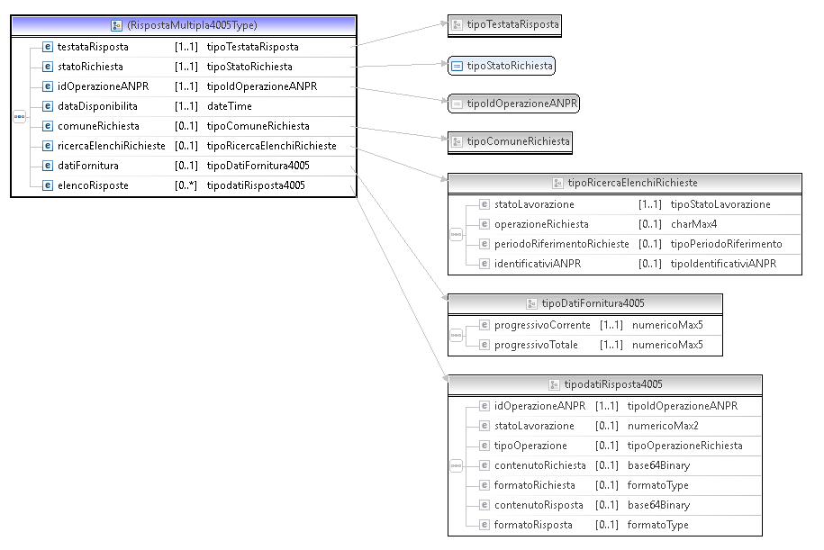

[Torna all'indice](../index.md)

# 4005 - richieste asincorne #

Autore : mttfranci, Date: 2019-06-05, Versione : 002

Abstract : 
Il servizio di richieste asincrone (4005) sostituisce la modalità 'elenchi richieste' dei servizi di gestione richieste (3003) e indetificativi ANPR (3007). Il nuovo servizio prevede due modalità. Con la prima (Elaborazione) viene inserita una richiesta di elaborazione, mentre la seconda (verifica stato) permette di verificare se la richiesta è e pronta e scaricarla.

Prerequisiti : Si assume che il comportamento generali dei servizi e in particolare del 3003/3007 sia gia' noto a chi legge.  

Issue github di approfondimento : 1161 (principale), 1275, 1277, 1232, 1219, 1294, 1301, 1260, 1227, 1198  

Il comportamento dei servizi 3003/3005/3007 cambiera'  solo invocandoli con il codDestintario ANPR02 (in tal caso verra'  restituito il codice EN379 se si provano a usare le funzionalita'  deprecate nella nuova versione).  
Per tutto il periodo di supporto alla versione ANPR01 sara'  possibile utilizzarli nella precedente modalita' .  
Come descritto nel documento del [Change management](https://github.com/italia/anpr/blob/master/src/change-management/change-management.md) la versione ANPR01 sara'  supportata in ogni ambiente per 3 mesi dal rilascio della versione ANPR02.  

*Flusso di una richiesta 4005*
- Richiesta in modalita'  "elaborazione" del 4005, catturando due parametri, l'id dell’elaborazione e la "data di disponibilita' "
- Primo tentativo di recupero della risposta temporizzato in base alla data stimata di disponibilita'  del servizio. Se la risposta a'¨ pronta il flusso termina, se non a'¨ pronta riprovare alla nuova “data di disponibilita' â€� (il servizio di verifica fornira'  una nuova stima in caso l’elaborazione non sia pronta).
NOTA: visto che la stima potrebbe essere sempre arrotondata per eccesso, se ritenete potete definire una classe di richieste pia'¹ urgenti delle altre e, solo per quelle, fare un primo tentativo dopo 30 minuti (qualora la data prevista di disponibilita'  sia superiore).

I wsdl del servizio 4005 sono disponibili sul [portale ANPR](https://www.anpr.interno.it/portale/documentazione-tecnica) insieme al dettaglio degli elementi. 

Ecco la struttura della richiesta : 
  

  

E della risposta : 

  

Ecco alcuni esempi di richieste e risposte : 
- Es 001 - Richiesta elaborazione operazioni stato lavorazione 1, [richiesta](4005_ex_001_req_elabora.xml), [risposta](4005_ex_001_res_elabora.xml)  
- Es 002 - Richiesta verifica stato con risposta in elaborazione, [richiesta](4005_ex_002_req_verifica.xml), [risposta](4005_ex_002_res_verifica.xml)  
- Es 003 - Richiesta elaborazione notifiche N031 stato lavorazione 9, [richiesta](4005_ex_003_req_elabora.xml), [risposta](4005_ex_003_res_elabora.xml)  
- Es 004 - Richiesta verifica stato con risposta pronta, [richiesta](4005_ex_004_req_verifica.xml), [risposta](4005_ex_004_res_verifica.xml)  

